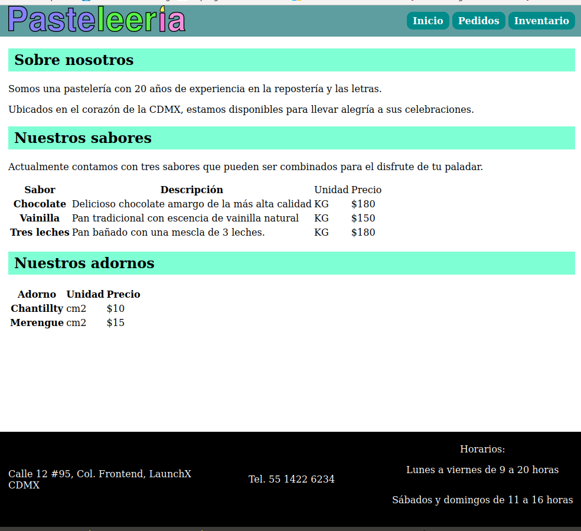
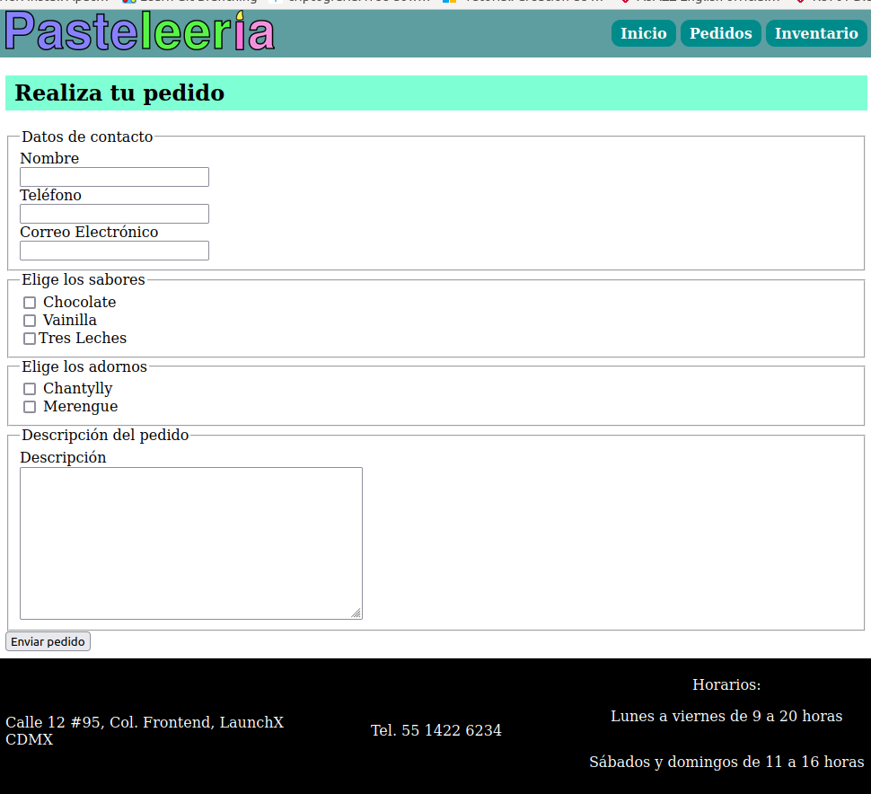
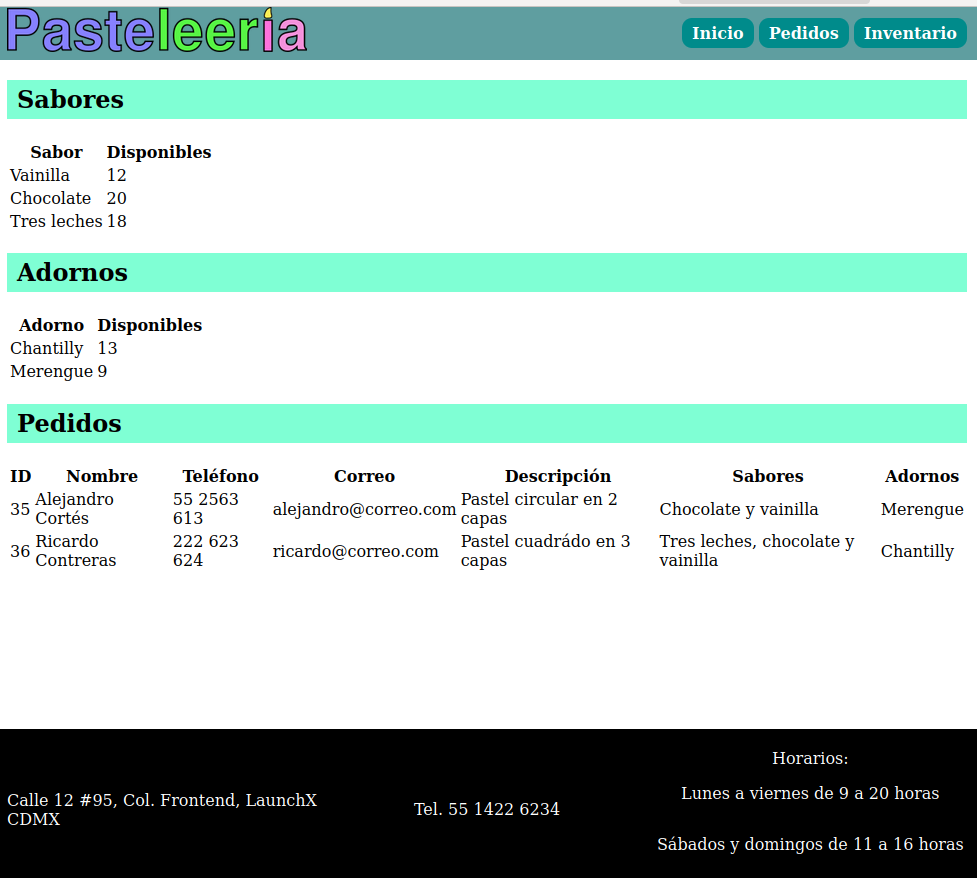

# Paste-leería

Ejercicios del módulo 2 del programa LaunchX-InnovaccionVirtual

## Marca

La paste-leería es un negocio enficado en clientes que gustan de la lectura, al realizar sus productos con referencias a temas relacionados todo tipo de escritos.

La maquetación se puede revisar en:

[Codigo](https://github.com/alcortes-dev/pasteleeria/tree/main/site)

Las imagenes de muestra:

### Home

### Formulario

### Pastelero

